# Clavis - Implementation Roadmap (Enterprise Edition, No Payments)

## Overview

This document outlines the step-by-step implementation plan for `Clavis`, a multi-tenant assessment platform, upgraded from the current Smart Quiz Engine prototype.

---

## Phase 1: Foundation (Week 1-2)

### Objectives
- Set up Supabase project and database
- Configure Next.js application
- Implement base authentication

### Tasks

#### 1.1 Supabase Setup
- [ ] Create Supabase project
- [ ] Configure project settings (region, backups, auth)
- [ ] Set up environment variables
- [ ] Install Supabase CLI

#### 1.2 Database Schema
- [ ] Create schema for institutions, admins, subjects, questions, exams, PINs, attempts, answers, results, audit logs
- [ ] Create migrations folder
- [ ] Enable Row Level Security on all tenant tables
- [ ] Seed default system data (roles, defaults)
- [ ] Create helper functions and triggers

#### 1.3 Next.js Setup
- [x] Initialize Next.js project with TypeScript
- [x] Configure Tailwind CSS
- [x] Set up Supabase client/server clients
- [x] Create base layouts (public/admin)
- [x] Configure env validation

#### 1.4 Authentication
- [x] Implement login page
- [x] Implement registration/onboarding page (or invite-only admin flow)
- [x] Set up auth middleware
- [x] Session management
- [x] Role claims / authorization helpers

**Deliverables**
- Working Supabase project
- Database schema deployed
- Next.js app running locally

---

## Phase 1.5: Tenant Isolation Validation (Week 2)

### Objectives
- Verify RLS policies work correctly
- Test cross-tenant access prevention
- Validate security boundaries

### Tasks

#### 1.5.1 RLS Testing Suite
- [ ] Test admin from Institution A cannot read Institution B data
- [ ] Test super admin override works correctly
- [ ] Test direct table queries from client are blocked
- [ ] Test attempt/answer/result isolation
- [ ] Test audit log tenant scoping

#### 1.5.2 Security Validation
- [ ] Attempt cross-tenant PIN access
- [ ] Attempt cross-tenant exam access
- [ ] Attempt to fetch correct answers via client API
- [ ] Validate service role is not exposed to client

**Deliverables**
- RLS validation report
- Security test results

---

## Phase 2: Multi-Tenant System (Week 2-3)

### Objectives
- Implement institution onboarding
- Create admin role management
- Build dashboard skeleton
- Implement audit logging

### Tasks

#### 2.1 Institution Management
- [ ] Institution CRUD
- [x] Institution settings page
- [ ] Logo/branding upload
- [ ] Timezone/locale settings

#### 2.2 Admin Role Management
- [x] Admin invitation system
- [x] Role-based access control (owner/admin/editor/viewer)
- [x] Admin list view
- [x] Admin activation/deactivation

#### 2.3 Dashboard
- [x] Dashboard layout
- [x] Overview statistics
- [x] Quick actions
- [x] Navigation shell

#### 2.4 Audit Logging
- [ ] Audit log trigger functions
- [x] Log admin invites
- [ ] Log exam publish actions
- [x] Log PIN generation actions
- [x] Log settings changes
- [ ] Log question import/delete/restore actions

#### 2.5 Usage Limits Skeleton (No Billing)
- [x] Usage tracking tables
- [x] Limit checking utilities
- [x] Guard middleware for API/Edge functions
- [x] Implement question count limits
- [x] Implement exam creation limits
- [x] Implement PIN generation limits
- [x] Implement admin invite limits

**Deliverables**
- Institution management functional
- Audit logging active
- Usage-limit framework in place

---

## Phase 3: Question Engine (Week 3-4)

### Objectives
- Build subject management with soft delete
- Create question bank with soft delete
- Implement XML import
- Add question intelligence basics

### Tasks

#### 3.1 Subject Management
- [x] Subject CRUD with soft delete
- [x] Build subject list view
- [x] Add subject settings
- [x] Implement question count tracking

#### 3.2 Question Bank (v1 Question Types)
- [x] Create multiple choice (single answer)
- [x] Create multiple choice (multiple answers)
- [x] Create True/False
- [x] Create Short answer (auto-gradable only)
- [x] Build question editor
- [x] Implement question preview
- [x] Add difficulty tagging
- [x] Create question search/filter
- [x] Implement soft delete/restore

#### 3.3 XML Import
- [x] Define XML schema
- [x] Create XML parser function
- [x] Implement bulk import
- [x] Add duplicate detection via hash
- [x] Handle import errors

#### 3.4 Question Intelligence
- [x] Implement hash generation
- [x] Add duplicate detection
- [x] Track question usage stats

**Deliverables**
- Question management with soft delete
- XML import working
- Duplicate prevention active

---

## Phase 4: Exam Builder (Week 4-5)

### Objectives
- Create exam configuration UI
- Implement question selection
- Build difficulty ratio logic
- Implement soft delete

### Tasks

#### 4.1 Exam Configuration
- [x] Create exam form builder
- [x] Add time limit settings
- [x] Implement passing score
- [x] Configure shuffle options
- [x] Add result visibility settings
- [x] Add attempt settings (single/retry if allowed)

#### 4.2 Question Selection
- [x] Build question picker UI
- [x] Implement search/filter
- [x] Add difficulty distribution
- [x] Create random question selection
- [x] Add manual override selection

#### 4.3 Exam Preview & Publishing
- [x] Build exam preview
- [x] Add exam validation
- [x] Implement publish workflow
- [x] Log exam publish/unpublish to audit

#### 4.4 Exam Soft Delete
- [x] Implement soft delete for exams
- [x] Add restore functionality
- [x] Update audit logging

**Deliverables**
- Full exam builder
- Question selection working
- Exam publishing functional

---

## Phase 5: PIN System (Week 5-6)

### Objectives
- Generate and manage PINs securely
- Create bulk PIN generation
- Implement PIN validation
- Add brute force protection

### Tasks

#### 5.1 PIN Generation (Secure)
- [x] Create single PIN generator (hashed)
- [x] Implement PIN format options
- [x] Add usage limits
- [x] Configure expiry dates
- [x] Bind PINs to exams

#### 5.2 Bulk PIN Generation
- [x] Build bulk PIN generator
- [x] Add prefix customization
- [x] Implement CSV export
- [x] Create PIN batches

#### 5.3 Allow List
- [x] Add allow list feature
- [x] Import from CSV
- [x] Manual entry form

#### 5.4 PIN Management
- [x] Create PIN list view
- [x] Add PIN deactivation
- [x] Implement usage tracking
- [x] Add batch actions

#### 5.5 Brute Force Protection
- [x] Implement rate limiting per IP
- [x] Add failed attempt tracking
- [x] Temporary lock after threshold
- [x] Log PIN validation attempts

**Deliverables**
- Secure PIN generation
- PIN validation with rate limiting

---

## Phase 6: Candidate Engine (Week 6-7)

### Objectives
- Build PIN entry page
- Create exam interface
- Implement timer and auto-save
- Implement resume feature

### Tasks

#### 6.1 PIN Entry
- [x] Create public PIN entry page
- [x] Implement PIN validation with rate limit check
- [x] Add candidate registration form
- [x] Build allow list check

#### 6.2 Exam Interface
- [x] Create exam taking UI
- [x] Implement question navigation
- [x] Add answer selection
- [x] Build progress indicator
- [x] Add accessibility and mobile optimization

#### 6.3 Timer System (Server-Validated)
- [x] Implement countdown timer
- [x] Add warning notifications
- [x] Auto-submit on timeout
- [x] Validate timer server-side using `started_at`

#### 6.4 Auto-Save
- [x] Implement periodic save
- [x] Add manual save button
- [x] Create answer history (optional)
- [x] Handle network failures gracefully

#### 6.5 Resume Feature
- [x] Store attempt state
- [x] Implement resume flow
- [x] Handle exam expiry
- [x] Add resume validation rules

**Deliverables**
- Candidate can start exam
- Timer and auto-save working
- Resume functionality active

---

## Phase 7: Scoring, Integrity & Load Testing (Week 7-8)

### Objectives
- Implement server-side scoring
- Track integrity signals
- Calculate integrity score
- Precompute analytics
- Load test critical paths

### Tasks

#### 7.1 Server-Side Scoring
- [x] Create scoring function
- [x] Calculate percentage
- [x] Implement grading logic
- [x] Add grade letters/bands

#### 7.2 Precomputed Analytics
- [x] Increment exam statistics on submission
- [x] Increment question statistics on submission
- [x] Store precomputed aggregates
- [x] Avoid full table scans

#### 7.3 Integrity Tracking
- [x] Track tab switches
- [x] Track fullscreen exits
- [x] Record time anomalies
- [x] Log suspicious client events

#### 7.4 Integrity Scoring
- [x] Calculate integrity score
- [x] Flag suspicious attempts
- [x] Create review workflow

#### 7.5 Load Testing
- [ ] Test 500 simultaneous submissions
- [ ] Test 1000 simultaneous PIN validations
- [ ] Identify bottlenecks
- [ ] Optimize as needed

**Deliverables**
- Server-side scoring complete
- Analytics precomputed
- Load tested system

---

## Phase 8: Analytics Dashboards (Week 8-9)

### Objectives
- Build exam analytics dashboards
- Create question intelligence views
- Implement exports

### Tasks

#### 8.1 Exam Analytics Dashboard
- [x] Display exam statistics
- [x] Generate score distribution charts
- [x] Track pass rates
- [x] Show question-level breakdown

#### 8.2 Question Intelligence
- [x] Calculate discrimination index
- [x] Track option popularity
- [x] Identify problem questions
- [x] Show difficulty analysis

#### 8.3 Exports
- [x] Create CSV export
- [x] Implement PDF export
- [x] Add bulk export

**Deliverables**
- Full analytics dashboard
- Export functionality complete

---

## Phase 9: Operations, Governance & Global Admin (Week 9-10)

### Objectives
- Full usage enforcement (non-billing)
- Super admin controls
- Platform operations tooling

### Tasks

#### 9.1 Full Usage Enforcement
- [x] Connect usage tracking to enforcement
- [x] Block actions when limits exceeded
- [x] Show usage warnings/prompts
- [x] Track admin invites
- [x] Track storage usage
- [x] Track question/exam/PIN limits

#### 9.2 Super Admin Controls
- [x] Manage institutions
- [x] View global analytics
- [x] View platform-wide audit logs
- [x] Suspend/reactivate institutions
- [x] Provide support override tools (logged)

#### 9.3 Operational Tooling
- [x] Error monitoring setup
- [x] Background job visibility
- [x] Reprocessing tools for failed imports/scoring
- [x] Admin support workflow

**Deliverables**
- Usage limits fully enforced
- Super admin controls working
- Operations tooling available

---

## Phase 10: Hardening & Deployment (Week 10-11)

### Objectives
- Optimize performance
- Security audit
- Backup & disaster recovery
- Deploy to production

### Tasks

#### 10.1 Security Hardening
- [x] Ensure service role key never bundled client-side
- [x] Lock down Supabase policies from anon role
- [x] Add CSP headers in Next.js
- [x] Add XSS protection
- [x] Add CSRF mitigation
- [x] Add input validation on all server actions/functions

#### 10.2 Performance
- [ ] Query profiling
- [x] Optimize slow queries
- [x] Add composite indexes based on usage patterns
- [ ] Implement caching strategy

#### 10.3 Backup & Disaster Recovery
- [ ] Enable Supabase PITR
- [ ] Set up weekly export snapshots
- [ ] Document restore procedure
- [ ] Test restore process

#### 10.4 Deployment
- [ ] Configure Vercel
- [ ] Set up environment
- [ ] Configure CORS
- [ ] SSL certificates
- [ ] Domain setup
- [ ] Monitoring/logging

#### 10.5 Security Tests
- [ ] Attempt to fetch correct answers via API
- [ ] Attempt cross-tenant access
- [ ] Attempt replay submission
- [ ] Attempt duplicate attempt submission
- [ ] Attempt timer manipulation

**Deliverables**
- Production deployment
- Security verified
- Backups configured

---

## Implementation Dependencies

```mermaid
flowchart LR
    P1[Phase 1: Foundation] --> P1_5[Phase 1.5: RLS Validation]
    P1_5 --> P2[Phase 2: Multi-Tenant]
    P2 --> P3[Phase 3: Question Engine]
    P3 --> P4[Phase 4: Exam Builder]
    P4 --> P5[Phase 5: PIN System]
    P5 --> P6[Phase 6: Candidate Engine]
    P6 --> P7[Phase 7: Scoring and Load Testing]
    P7 --> P8[Phase 8: Analytics]
    P8 --> P9[Phase 9: Operations and Governance]
    P9 --> P10[Phase 10: Hardening]
```

---

## Critical Path Items

1. Database Schema
2. RLS Validation
3. Authentication and RBAC
4. Usage Limits Skeleton
5. Question Engine
6. Exam Builder and PIN System
7. Server-Side Scoring
8. Load Testing and Hardening

---

## Scope Boundaries

### v1 Features (This Release)
- Multiple choice (single)
- Multiple choice (multiple)
- True/False
- Short answer (auto-gradable)
- PIN-based access
- Server-side scoring
- Basic analytics

### v2 Features (Future)
- Essay questions
- Fill in the blank
- Manual grading workflow
- Advanced question types
- Webcam proctoring

---

## Testing Strategy

### Unit Tests
- Database functions
- Utility functions
- Validation logic

### Integration Tests
- API endpoints
- User flows
- Auth and RBAC

### E2E Tests
- Admin workflows
- Candidate exam flow
- Full registration

### Security Tests
- Attempt cross-tenant access
- Attempt to fetch correct answers
- Attempt replay submission
- Attempt duplicate submissions

### Performance Tests
- 500 simultaneous submissions
- 1000 PIN validations
- Large XML import (1000+ questions)

---

## Migration Strategy From Current Project

1. Keep current app as a reference prototype for flows and UX patterns.
2. Build the new `Clavis` platform in a separate Next.js codebase (recommended folder: `clavis`).
3. Migrate features in this order:
- Auth and institutions
- Subjects and questions
- Exams
- PINs
- Candidate flow
- Scoring and results
- Analytics and admin polish

---

*Version: 1.0.0 (No Payments)*
*Updated: 2026-02-24*

